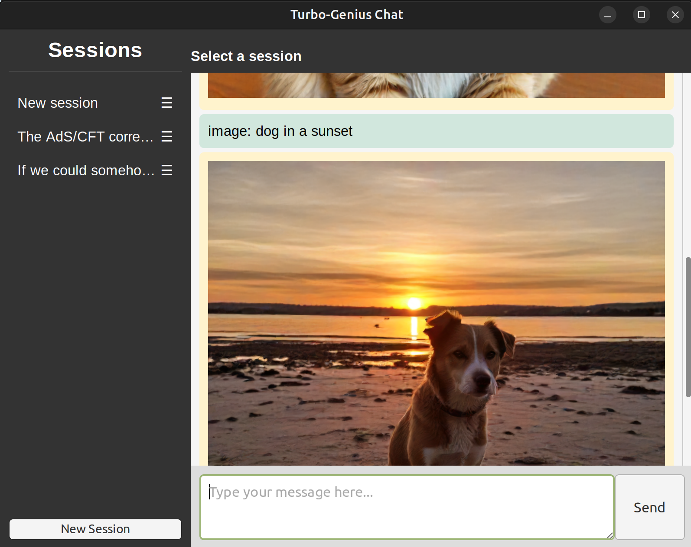

# Turbo-Genius
Streaming local llm server and client.

## Features
 - streaming llm server and client
 - session management and persistence
 - automatic title summary
 - syntax highlighting and latex formatting
 - image generation capabilities

## Dependencies
    sudo apt install nvidia-cuda-toolkit
    sudo apt-get install sqlite3 libsqlite3-dev

    # Create a conda env with
    bash 00_create_env.sh

    # for whatever reason these modules have to be installed separately
    pip install packaging torch

    # Install the rest of the dependencies
    pip install -r requirements.txt

## Server
Run any text-generation model from huggingface

### Run in docker
    docker build . --tag="turbo-genius"
    docker run --gpus all -e HUGGINGFACE_TOKEN=<token> -d -p 8000:8000 turbo-genius

### Run in terminal
    python server.py --model <model> --image_generation --image_cpu_offload

## Clients

### Text based client
    python cli.py --host <host> --port <port>

### Chat client desktop app
    python client.py --host <host> --port <port>
